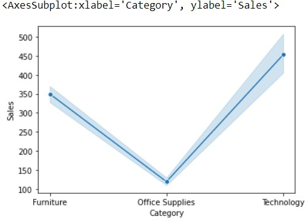

# Ex-08-Data-Visualization-

# AIM:
To Perform Data Visualization on a complex dataset and save the data to a file. 

# EXPLANATION:
Data visualization is the graphical representation of information and data. By using visual elements like charts, graphs, and maps, data visualization tools provide an accessible way to see and understand trends, outliers, and patterns in data.

# ALGORITHM:
### STEP 1
Read the given Data.
### STEP 2
Clean the Data Set using Data Cleaning Process.
### STEP 3
Apply Feature generation and selection techniques to all the features of the data set.
### STEP 4
Apply data visualization techniques to identify the patterns of the data.


# CODE:
```python
import pandas as pd
df=pd.read_csv("Superstore.csv")
df

df.isnull()

df.isnull().sum()

#Data Visualization using Seaborn
import seaborn as sns
from matplotlib import pyplot as plt

plt.figure(figsize=(9,6))
sns.lineplot(x="Segment",y="Region",data=df,marker='o')
plt.xticks(rotation = 90)

sns.lineplot(x='Ship Mode',y='Category', hue ="Segment",data=df)

sns.lineplot(x="Category",y="Sales",data=df,marker='o')

sns.scatterplot(x='Category',y='Sub-Category',data=df)

sns.scatterplot(x='Category', y='Sub-Category', hue ="Segment",data=df)

plt.figure(figsize=(10,7))
sns.scatterplot(x="Region",y="Sales",data=df)
plt.xticks(rotation = 90)

sns.boxplot(x="Sub-Category",y="Discount",data=df)

sns.boxplot( x="Profit", y="Category",data=df)

sns.violinplot(x="Profit",data=df)

sns.barplot(x="Sub-Category",y="Sales",data=df)
plt.xticks(rotation = 90)

sns.barplot(x="Category",y="Sales",data=df)
plt.xticks(rotation = 90)

sns.pointplot(x=df["Quantity"],y=df["Discount"])

sns.countplot(x="Category",data=df)

sns.countplot(x="Sub-Category",data=df)

sns.histplot(data=df,x ='Ship Mode',hue='Sub-Category')

sns.kdeplot(x="Profit", data = df,hue='Category')

#Data Visualization Using MatPlotlib
plt.plot(df['Category'], df['Sales'])
plt.show()

df.corr()
plt.subplots(figsize=(12,7))
sns.heatmap(df.corr(),annot=True)

df1=df.groupby(by=["Ship Mode"]).sum()
labels=[]
for i in df1.index:
    labels.append(i)
colors=sns.color_palette("bright")
plt.pie(df1["Sales"],labels=labels,autopct="%0.0f%%")
plt.show()

df3=df.groupby(by=["Category"]).sum()
labels=[]
for i in df3.index:
    labels.append(i) 
plt.figure(figsize=(8,8))
colors = sns.color_palette('pastel')
plt.pie(df3["Profit"],colors = colors,labels=labels, autopct = '%0.0f%%')
plt.show()

plt.hist(df["Sub-Category"],facecolor="peru",edgecolor="blue",bins=10)
plt.show()

plt.bar(df.index,df['Category'])
plt.show()

plt.scatter(df["Region"],df["Profit"], c ="blue")
plt.show() 

plt.boxplot(x="Sales",data=df)
plt.show()
```
# OUTPUT:
### Given Dataset:


## Data Visualization By Seaborn
### Line Plot:



### Scatter Plot:


### Box Plot:


### Violin Plot:

### Barplot:


### Pointplot:

### Countplot:


### Histogram:

### KDE Plot:

## Data Visualization By Matplotlib:
### Plot:

### Heatmap:

### Piechart:


### Histogram:

### Bargraph:

### Scatterplot:

### Boxplot:


# RESULT:
Thus Data Visualization is applied on the given dataset using libraries like Seaborn and Matplotlib successfully.